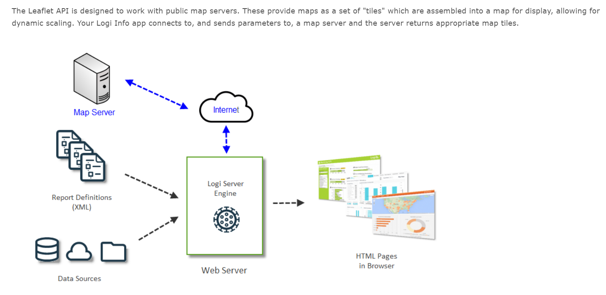

## Available Scripts

In the project directory, you can run:

### `Install NodeJS`

### `Go to project directory`

### `npm install`

### `npm start`

## Email server

### How to start the email server

### `in the console type to the email server directory: cd src/components/server`

### `after you are at this directory run this command: node server.js`

Open [http://localhost:4000](http://localhost:4000) and you should see Welcome to the Sendgrid Emailing Server

Runs the app in the development mode. 
Open [http://localhost:3000](http://localhost:3000) to view it in the browser.

The page will reload if you make edits. 
You will also see any lint errors in the console.

## How to deploy?

### 1.Commit all changes in master branch

### 2. `npm run build`

### 3. `firebase deploy`

Deploy URL: app.soilviews.com
About the project: soilviews.com

## How to build and run docker container with the app running on?

### 1.docker build -t soilviews:1.0 .

### 2.docker run -d -p 3000:3000 -e TZ=Europe/Sofia --name soilviews soilviews:1.0

## Architecture

